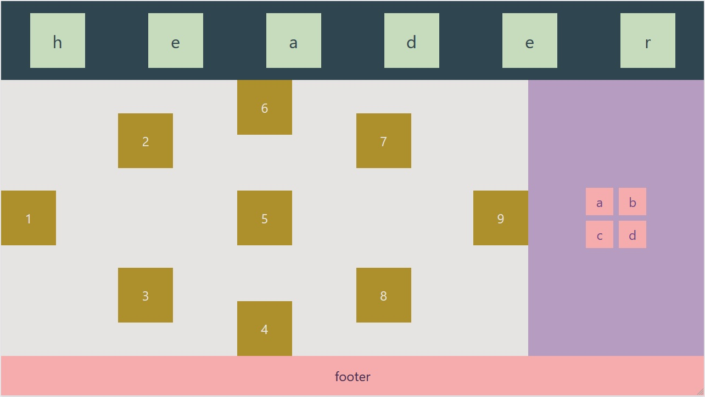

# Grid
Com este sistema de layout podemos manipular a página de forma **bidimensional**, dividindo-a em linhas e colunas.

Suas propriedades são separadas em dois grupos: as dos `contêineres` e dos `itens`:

```css
.container {
    display: grid;
    grid-template-columns: ;
    grid-template-rows: ;
    grid-template-areas: ;
    grid-gap: ;
}
```

```css
.item {
    display: grid;
    grid-column: ;
    grid-row: ;
    grid-area: ;
}
```

## Propriedades de alinhamento

Podem ser utilizados tanto nos `contêineres` como nos `itens`.

```css
.alinhamento {
    justify-content: start|end|center|stretch|space-between|space-around|space-evenly;
    align-content: ;
    justify-items: start|end|center|stretch;
    align-items: ;
    justify-self: start|end|center|stretch;
    align-self: ;
}
```

- o primeiro termo diz respeito aos eixos x e y, respectivamente.
  - `justify`: é o posicionamento horizontal, da esquerda para direita;
  - `align`: representa o posicionamento vertical, de cima para baixo.
- o segundo termo indica que elemento(s) será afetado
  - `content`: permite alinhar o próprio grid no espaço que lhe é destinado
  - `items`: permite alinhar os `items` do grid no espaço disponível na célula que ele estiver
  - `self`: possui o mesmo comportamento de `items`, mas o estilo é aplicado no próprio elemento e não no container

